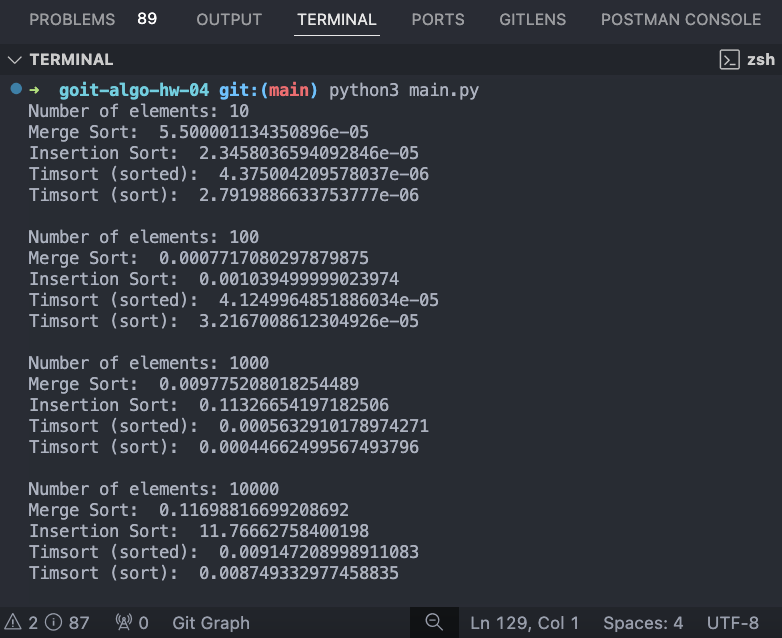

### Результат виконання коду

### Висновки

**Timsort (sorted і sort):**

Timsort показав найкращі результати на всіх наборах даних.
Це підтверджує його ефективність завдяки гібридній природі,яка поєднує сортування злиттям та сортування вставками.
Використання вбудованих функцій sorted і sort є найбільш доцільним для більшості завдань сортування в Python.

**Merge Sort:**

Merge Sort є ефективним для середніх і великих наборів даних, але поступається Timsort.
Цей алгоритм має стабільну продуктивність, але його час виконання збільшується зі збільшенням розміру даних.

**Insertion Sort:**

Insertion Sort працює добре на малих наборах даних, але його ефективність різко падає з збільшенням розміру даних.
Через квадратичну складність, цей алгоритм не підходить для великих наборів даних.
